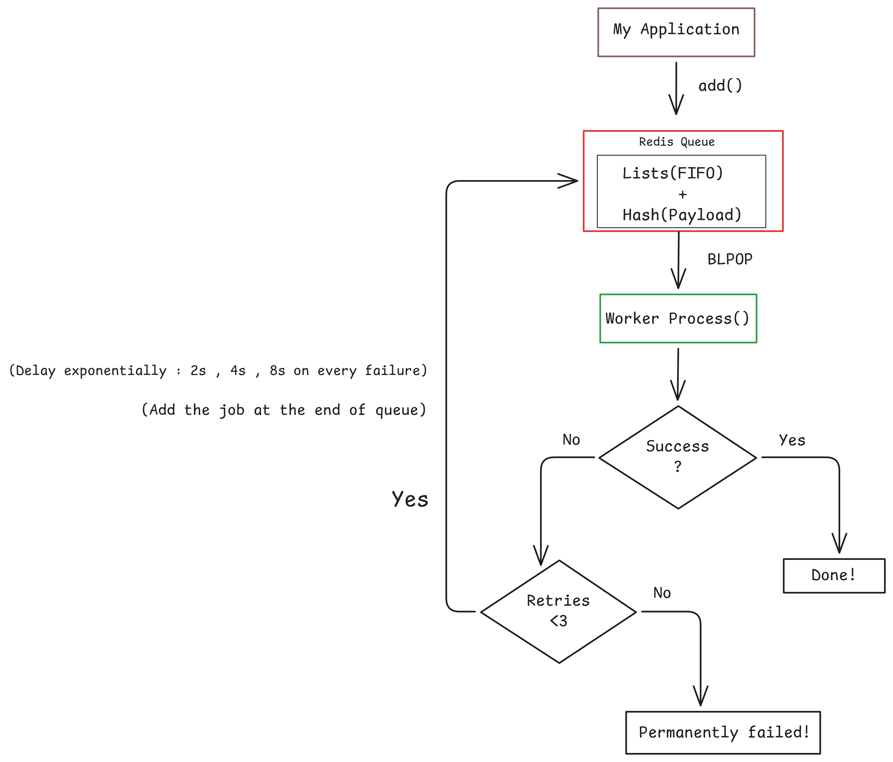

# redis-job-queue

A job queue implementation using Redis , featuring automatic retries and exponential backoff , built to explore how libraries like BullMQ work under the hood.

This project demonstrates core mechanisms of job queues like job storage , List processing(FIFO) and retry patterns and is not meant for production use.

 
## Features

- Simple and Lightweight
    : Simple architecture based on list and hash
- Automatic retries
    : Failed jobs retry upto 3 times automatically
- Exponential backoff
    : Retries with delays increasing exponentially on every failure (2s , 4s, 8s)
- Job status tracking
    : Track statuses of jobs between waiting , processing , finished , failed and premanently failed (>3 retries)
- Built on top of Redis
## Architecture


 The queue uses following Redis data structures :
 - List : Stores job Ids in FIFO order
 - Hash : Stores job metadata
## How It Works
**Add job :** App calls add(jobData) which creates job hash and pushes jobId into waiting list

**Process Jobs :** Worker calls process(handlerFn) which uses BLPOP to wait for jobs in the queue

**On Success :** Job marked as "finished"

**On Failure :** 
- If retries <3 : Wait with exponential backoff (2s , 4s, 8s) , then re-queue
- If retries >=3 : Mark as "failed permanently"
- Attempt 1 fails -> wait 2s ->re-queue job at end of the list
- Attempt 2 fails -> wait 4s ->re-queue job at end of the list
- Attempt 3 fails -> wait 8s ->re-queue job at end of the list
- After 3 attempts mark as "failed permanently"
## Usage/Examples

```javascript
import Queue from './queue.js'

const emailQueue = new Queue('emails')

await emailQueue
.add({ email: 'jondoe@gmail.com', msg: 'hello jd' });

await emailQueue
.add({ email: 'groot@gmail.com', msg: 'hello groot' });

emailQueue.process(async (job) => {
    console.log('job is processing', job.id);
    console.log('job details', job.data);

})


```


## Design Trade-offs
**Current approach :**
- Simple to implement and understand
- Worker blocks during retry delays
- May forcefully make the external Api of the job rate-limit
- Cannot handle service outages well

**Future improvements :**
- Dead letter queue for failed jobs
- Job priorities
## Built with

- Node.js
- Redis (Lists & Hashes)
- Exponential backoff retry pattern